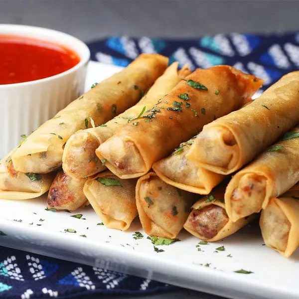

# :burrito: Lumpia

{ loading=lazy }

| :timer_clock: Total Time |
|:-----------------------: |
| 10 minutes |

## :salt: Ingredients

- :tea: 0.5 medium onion
- :olive: 1 tsp (4 g) vegetable oil
- :garlic: 2 cloves garlic
- :apple: 1 lb ground pork or chicken
- :leafy_green: 0.5 lb shrimp (optional)
- :garlic: 0.75 tsp garlic powder
- :chestnut: 1 tsp (2 g) onion powder
- :salt: 1 tsp salt
- :chestnut: 0.5 tsp ginger powder
- :beans: 0.5 head green cabbage
- :carrot: 2 carrots
- :burrito: 2 cups bean sprouts (optional)
- :bread: some egg roll wrappers
- :bread: some flour
- :droplet: some water
- :olive: some vegetable oil

## :pencil: Instructions

### Step 1

Saute onion in 1 tsp vegetable oil until soft. Add minced garlic and ground pork or chicken until done.

### Step 2

Add shrimp (optional), and garlic powder, onion powder, salt, and ginger powder, simmer 5 minutes and then add green
cabbage and shredded carrots. Cook for 5 minutes.

### Step 3

Turn off fire and while mixture is still hot, stir in rinsed bean sprouts (optional).

### Step 4

Let mixture cook completely and drain off excess liquid.

### Step 5

Place mixture inside of egg roll wrappers and glue with flour and water and deep fry in vegetable oil until golden
brown.

## :link: Source

- Tante Myrna Seccia
