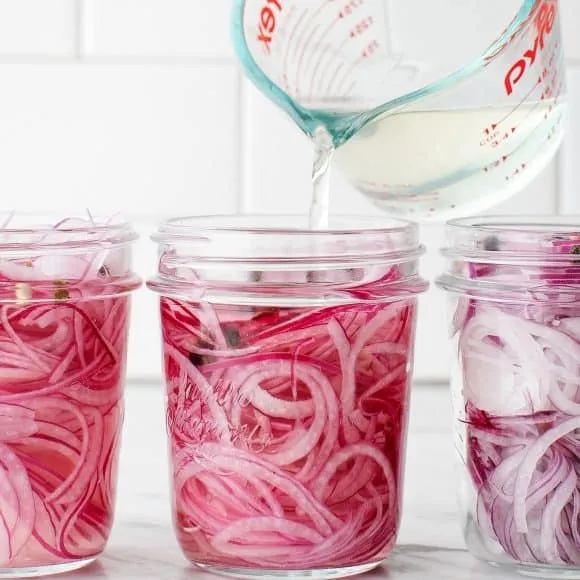

---
tags:

  - sides
comments: true

hero: assets/images/pickled-red-onions.webp
---

# :cucumber: Pickled Red Onions

{ loading=lazy }

| :fork_and_knife_with_plate: Serves | :timer_clock: Total Time |
|:----------------------------------:|:-----------------------: |
| 12 | 1.02 hours |

## :salt: Ingredients

- :tea: 2 small red onions
- :garlic: 2 cloves garlic
- :carrot: 1 tsp mixed peppercorns
- :takeout_box: 2 cups (212 g) white vinegar
- :droplet: 2 cups (454 g) water
- :candy: 0.33 cup (51 g) cane sugar
- :salt: 2 Tbsp sea salt

## :cooking: Cookware

- 1 mandoline
- 2 16-ounce jars
- 1 medium saucepan

## :pencil: Instructions

### Step 1

Thinly slice the red onions (it's helpful to use a mandoline), and divide the onions between 2 16-ounce jars or 3
(10-ounce) jars. Place the garlic and mixed peppercorns in each jar, if using.

### Step 2

Heat the white vinegar, water, cane sugar, and sea salt in a medium saucepan over medium heat. Stir until the sugar and
salt dissolve, about 1 minute. Let cool and pour over the onions. Set aside to cool to room temperature, then store the
onions in the fridge.

### Step 3

Your pickled onions will be ready to eat once they're bright pink and tender - about 1 hour for very thinly sliced
onions, or overnight for thicker sliced onions. They will keep in the fridge for up to 2 weeks.

## :link: Source

- <https://www.loveandlemons.com/pickled-red-onions/>
