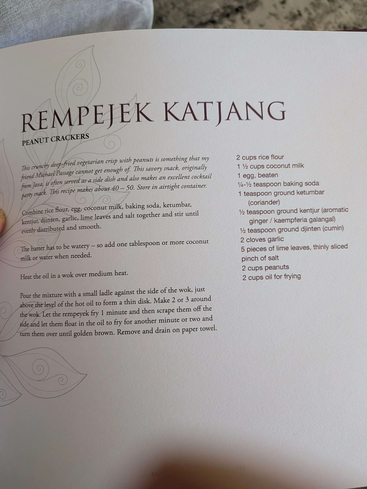

# :chestnut: Rempejek Katjang

{ loading=lazy }

| :fork_and_knife_with_plate: Serves | :timer_clock: Total Time |
|:----------------------------------:|:-----------------------: |
| 12 | 45 minutes |

## :salt: Ingredients

- :bread: 2 cups (256 g) rice flour
- :chestnut: 1 tsp (2 g) ground ketumbar (coriander)
- :sweet_potato: 1 tsp (3 g) ground kencur (aromatic ginger)
- :chestnut: 1/2 tsp (2 g) ground djinten (cumin)
- :garlic: 2 cloves garlic, finely minced
- :salt: 1 pinch salt
- :coconut: 1.5 cups (171 g) coconut milk
- :egg: 1 egg, beaten
- :baby_bottle: 1 Tbsp (18 g) water (or more, to thin batter)
- :herb: 5 lime leaves, thinly sliced
- :olive: 2 cups (400 g) oil
- :chestnut: 2 cups (396 g) raw peanuts

## :cooking: Cookware

- 1 large bowl
- 1 wok
- paper towels

## :pencil: Instructions

### Step 1

In a large bowl, whisk together the **rice flour**, **ground ketumbar**, **ground kencur**, **ground djinten**, **garlic**, and **salt**.

### Step 2

Gradually stir in the **coconut milk** and **beaten egg** until a smooth, thin batter forms. If the batter is too thick, stir in **water** (or more) to thin it out. Stir in the thinly sliced **lime leaves**.

### Step 3

Heat the **oil** in a wok over medium heat.

### Step 4

Scoop up a small ladle of the batter and sprinkle a few **raw peanuts** into the ladle.

### Step 5

Carefully pour the batter against the hot inner wall of the wok, just above the oil level, allowing it to spread into a thin disk. The hot oil will cause the cracker to naturally slide down into the center of the wok as it cooks.

### Step 6

Let the rempeyek fry for 1 minute until it releases from the wall and slides into the oil, then turn them over and fry for another 1 to 2 minutes until golden brown and crispy.

### Step 7

Remove the crackers and drain on paper towels. Let them cool completely before serving.

## :link: Source

- *Indo Dutch Kitchen Secrets* by Jeff Kesberry ([GitHub Issue #1365](https://github.com/nicholaswilde/recipes/issues/1365))
