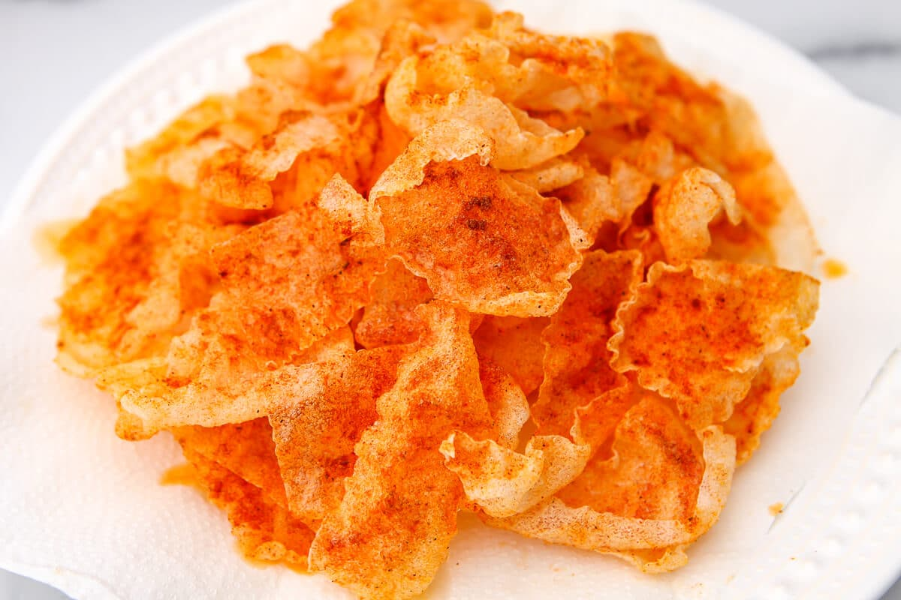

# :bread: Rice Paper Chicharrones Gracias Madre

{ loading=lazy }

| :timer_clock: Total Time |
|:-----------------------: |
| 1 minute |

## :salt: Ingredients

- :olive: 1 inch neutral oil
- :bread: 12 (120 g) rice paper wrappers
- :salt: some Himalayan salt
- :hot_pepper: some paprika

## :cooking: Cookware

## :pencil: Instructions

### Step 1

In a heavy-bottomed, high-sided frying pan over medium-high heat, heat about 1 inch of neutral oil for frying to 350°F. Line a plate or baking sheet with a few layers of paper towels and place nearby for draining.

### Step 2

Working in batches, fry the rice paper wrappers in the hot oil until it becomes puffy and crisp, about 1 minute.

### Step 3

Transfer to the plate to drain and immediately sprinkle with a pinch of Himalayan salt and paprika.

### Step 4

Once the chicharrones have cooled slightly, break them up a bit with your hands into craggy, bite-size pieces.

## :link: Source

- [Nicholas Wilde's Recipe #1229](https://github.com/nicholaswilde/recipes/issues/1229)
- Gracias Madre
