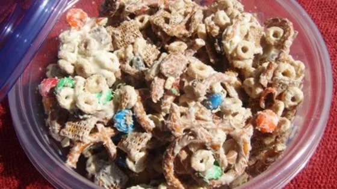

# :beans: White Trash

{ loading=lazy }

| :fork_and_knife_with_plate: Serves | :timer_clock: Total Time |
|:----------------------------------:|:-----------------------: |
| 12-15 | 0 minutes |

## :salt: Ingredients

- :ear_of_rice: 3 cups crispy corn cereal squares
- :ear_of_rice: 3 cups crispy rice cereal squares
- :ear_of_rice: 3 cups toasted oat cereal
- :bread: 2 cups miniature pretzels
- :chestnut: 2 cups salted peanuts
- :chocolate_bar: 20 oz white chocolate chips

## :cooking: Cookware

- 1 large bowl
- 1 microwave-safe bowl
- 1 wax paper

## :pencil: Instructions

### Step 1

In a large bowl, combine crispy corn cereal squares, crispy rice cereal squares, toasted oat cereal, miniature pretzels,
and salted peanuts.

### Step 2

Melt white chocolate chips in a microwave-safe bowl in 30-second intervals until smooth.

### Step 3

Pour melted chocolate over cereal mixture and toss to coat.

### Step 4

Spread on wax paper and cool until set.

## :link: Source

- <https://www.foodnetwork.com/recipes/alton-brown/white-trash-recipe-1941401>
