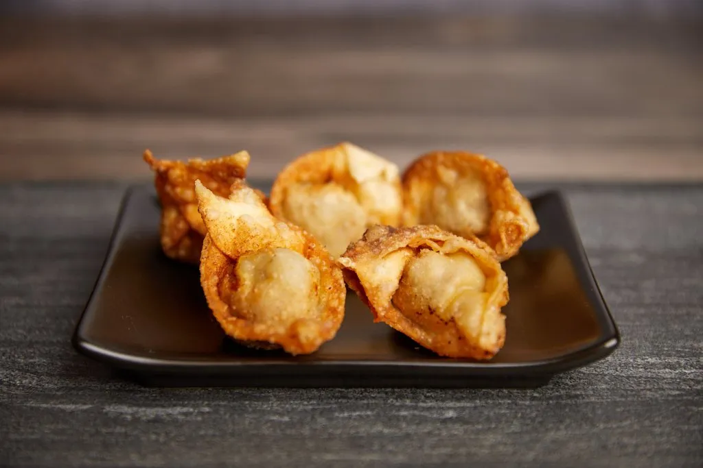

# :dumpling: Wontons

{ loading=lazy }

| :timer_clock: Total Time |
|:-----------------------: |
| 30 minutes |

## :salt: Ingredients

- :apple: 0.5 lb lean ground beef
- :salt: 0.25 tsp garlic salt
- :salt: 0.25 tsp salt
- :chestnut: 0.25 tsp (1 g) onion powder
- :takeout_box: 2 splashes soy sauce
- :garlic: some wonton skins
- :apple: 0.5 tsp (2 g) Chinese hot sauce
- :chestnut: 0.5 tsp (3 g) peanut butter
- 0.5 cup catsup
- :candy: 1 Tbsp (10 g) sugar

## :pencil: Instructions

### Step 1

Mix lean ground beef, garlic salt, salt, onion powder, and soy sauce together and roll into 1/2 tsp balls.

### Step 2

Form them in wonton skins and fry.

### Step 3

Make dipping sauce by mixing Chinese hot sauce, peanut butter, catsup, and sugar.

## :link: Source

- Tante Myrna Seccia
