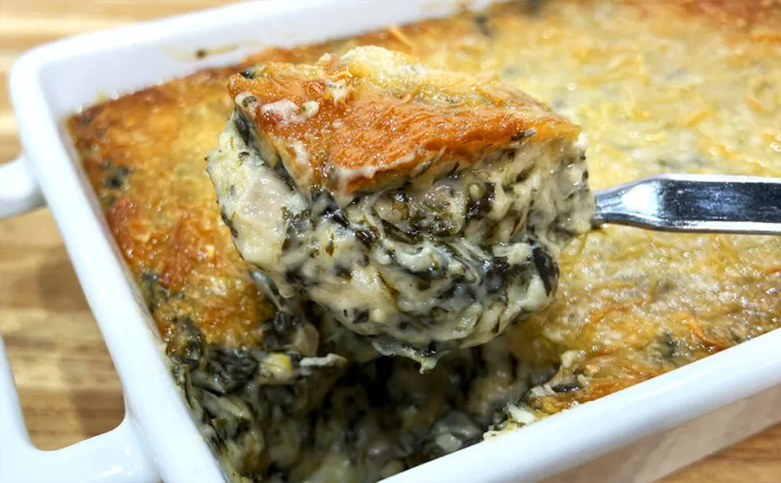

# :leafy_green: Creamed Spinach

{ loading=lazy }

| :timer_clock: Total Time |
|:-----------------------: |
| 14 minutes |

## :salt: Ingredients

- :leafy_green: 1 lb spinach
- :butter: 4 oz (113 g) unsalted butter
- :tea: 1 cup (142 g) red onion, diced
- :bread: 2 oz (30 g) all-purpose flour
- :glass_of_milk: 4 cups (908 g) milk
- :salt: some salt
- :salt: some pepper
- :garlic: 2 Tbsp garlic
- :droplet: 1 dash hot sauce
- :tangerine: 1 Tbsp (14 g) lemon juice
- :cheese_wedge: 4 oz (57 g) English cheddar
- 4 oz Gruyere
- :tangerine: 1 lemon zest
- :cheese_wedge: 2 Tbsp (12 g) Parmesan cheese
- :herb: 2 Tbsp parsley

## :cooking: Cookware

- 1 potato ricer
- 1 kitchen towel
- 1 saucepan
- 1 buttered lasagna pan

## :pencil: Instructions

### Step 1

Preheat oven to 275°F.

### Step 2

Remove the stems of the spinach leaves and steam in salty boiling water for about 1.5 minutes. Plunge them in ice water
to stop the cooking process, and squeeze as much water as possible using a potato ricer or your hands, or a kitchen
towel.

### Step 3

In a saucepan, heat the unsalted butter, add the red onion, diced and cook for a couple of minutes. Add the all-purpose
flour and cook for a couple more minutes. Add the milk and cook for 5 to 7 minutes at low heat and season to taste with
salt and pepper. Add the spinach and mix very well. Add garlic, hot sauce and lemon juice. Cook for a few more minutes
again and add the English cheddar, Gruyere (save a little to top the dish) and cook for another 5 minutes at low heat.
Add chopped parsley and lemon zest.

### Step 4

Pour the cooked mixture into a buttered lasagna pan and top the spinach with Parmesan cheese and parsley.

### Step 5

Bake in the preheated oven until golden brown.

## :link: Source

- <https://chefjeanpierre.com/recipes/side-dishes/creamed-spinach/>
