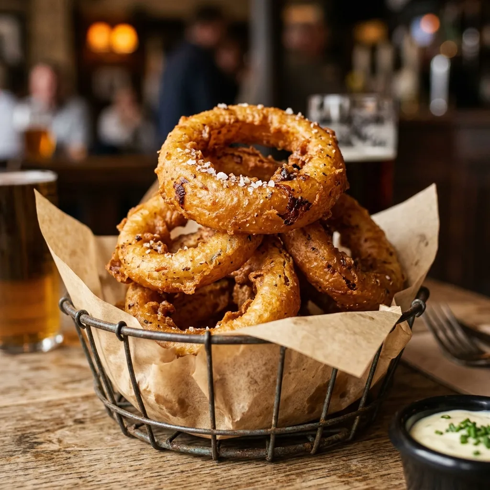

# :onion: Foolproof Onion Rings

{ loading=lazy }

| :fork_and_knife_with_plate: Serves | :timer_clock: Total Time |
|:----------------------------------:|:-----------------------: |
| 4 | 1.07 hours |

## :salt: Ingredients

- :onion: 2 large onions, cut into 1/2-inch rounds
- :peanuts: 2 qts peanut oil (or vegetable oil)
- :bread: 1 cup (120 g) all-purpose flour
- :chestnut: 0.5 cup (56 g) cornstarch
- 1 tsp [baking powder](../../ingredients/baking-powder.md)
- :chestnut: 0.25 tsp baking soda
- :candy: 0.5 tsp paprika
- :tumbler_glass: 0.75 cup (170 g) light-flavored beer (such as PBR or Budweiser)
- :tumbler_glass: 0.25 cup 80-proof vodka
- :salt: kosher salt

## :cooking: Cookware

- 1 gallon-sized zipper-lock freezer bag
- 1 bowl
- 1 rimmed baking sheet
- 1 clean kitchen towel
- 1 paper towels
- 1 large wok or Dutch oven
- 1 medium bowl
- 1 whisk
- 1 small bowl
- 1 large mixing bowl
- 1 paper towels
- 1 wire rack

## :pencil: Instructions

### Step 1

Separate the large onions, cut into 1/2-inch rounds into individual rings. Place in a gallon-sized zipper-lock freezer
bag and put them in the freezer until completely frozen, at least 1 hour (they can stay in the freezer for up to 1
month).

### Step 2

When ready to fry, remove the onion rings from the freezer bag, transfer to a bowl, and thaw under tepid running water.
Transfer to a rimmed baking sheet lined with a clean kitchen towel or several layers of paper towels and dry the rings
thoroughly. Carefully peel off the inner papery membrane from each ring and discard (the rings will be very floppy). Set
aside.

### Step 3

Preheat the peanut oil (or vegetable oil) to 375 °F in a large wok or Dutch oven over medium-high heat. Combine the
all-purpose flour, cornstarch, [baking powder](../../ingredients/baking-powder.md), baking soda, and paprika in a
medium bowl and whisk together. Combine the ice-cold light-flavored beer (such as PBR or Budweiser) and 80-proof vodka
in a small bowl.

### Step 4

Slowly add the beer mixture to the flour mixture, whisking constantly until the batter has the texture of thick paint
(you may not need all of the beer). The batter should leave a trail if you drip it back into the bowl off the whisk. Do
not overmix; a few small lumps are OK. Dip one onion ring in the batter, making sure that all surfaces are coated, lift
it out, letting the excess batter drip off, and add it to the hot oil by slowly lowering it in with your fingers until
just one side is sticking out, then dropping it in. Repeat until half of the rings are in the oil. Fry, flipping the
rings halfway through cooking, until they are deep golden brown, about 4 minutes. Transfer the rings to a large mixing
bowl lined with paper towels and toss while sprinkling kosher salt over them. The fried rings can be placed on a wire
rack on a rimmed baking sheet and kept hot in a 200 °F oven while you fry the remaining rings. Serve the rings
immediately.

## :link: Source

- The Food Lab
