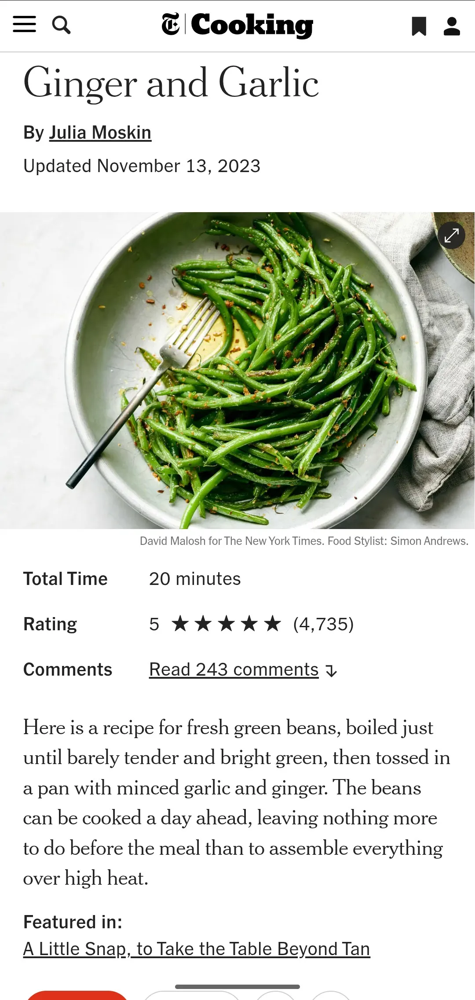

# Ginger and Garlic Green Beans

{ loading=lazy }

| :fork_and_knife_with_plate: Serves | :timer_clock: Total Time |
|:----------------------------------:|:-----------------------: |
| 10 | 4 minutes |

## :salt: Ingredients

- :droplet: some water
- :beans: 2.5 pounds green beans
- :olive: 2 tablespoons (25 g) vegetable oil
- :sweet_potato: 2 tablespoons (28 g) fresh ginger
- :garlic: 2 cloves garlic cloves
- :salt: some salt
- :olive: 2 tablespoons (25 g) vegetable oil
- :sweet_potato: 2 tablespoons (28 g) fresh ginger
- :garlic: 2 cloves garlic cloves

## :cooking: Cookware

- 1 large pot
- 1 large bowl
- 1 wide skillet

## :pencil: Instructions

### Step 1

Bring a large pot of salted water to a boil, and fill a large bowl with ice water. Working in two batches, boil green
beans (slim haricots verts work especially well, trimmed) until just tender but still crisp and bright green. Start
testing after 4 minutes or so, being careful not to overcook. When done, plunge beans into ice water to stop cooking,
lift out immediately when cool and drain on towels. (Recipe can be made to this point up to a day in advance and kept
refrigerated, wrapped in towels.)

### Step 2

When ready to cook, heat vegetable oil in a wide skillet over high heat. Add half the beans, half the fresh ginger
(minced, from 6 inches peeled ginger root) and half the garlic cloves (minced), and cook, stirring and tossing
constantly, until beans are heated through and ginger and garlic are softened and fragrant. Sprinkle with salt to taste,
and remove to a serving dish. Repeat with remaining vegetable oil, beans, fresh ginger, and garlic cloves. Serve.

## :link: Source

- NYT Cooking
