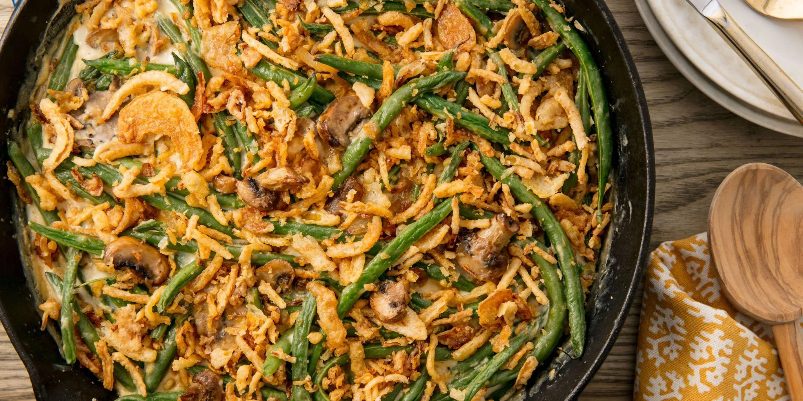

# :cucumber: Green Bean Casserole

{ loading=lazy }

| :timer_clock: Total Time |
|:-----------------------: |
| 30 minutes |

## :salt: Ingredients

- :butter: 0.33 stick butter
- :tea: 0.5 onions
- :mushroom: 0.5 cup (39 g) sliced mushrooms
- :beans: 2 cups (170 g) green beans
- 3 cups [vegetable broth][1]
- :droplet: 1 can cream of mushroom soup
- :glass_of_milk: 1 8-oz can French-fried onion rings
- :salt: some salt
- :salt: some pepper
- :garlic: some garlic powder
- :cheese_wedge: some cheddar cheese (optional)

## :cooking: Cookware

- 1 large skillet
- 1 saucepan
- 1 1.5 quart baking dish

## :pencil: Instructions

### Step 1

Preheat oven to 350°F.

### Step 2

Melt butter in a large skillet. Sauté onions and sliced mushrooms.

### Step 3

Add green beans to a saucepan and boil in [vegetable broth][1], then drain.

### Step 4

Add green beans, cream of mushroom soup, French-fried onion rings, salt, pepper, and garlic powder to taste.

### Step 5

Pour into 1.5 quart baking dish.

### Step 6

Bake for 20 minutes; sprinkle with cheddar cheese (optional) if desired, and bake for 10 minutes more.

[1]: <../../ingredients/vegetable-broth.md>
