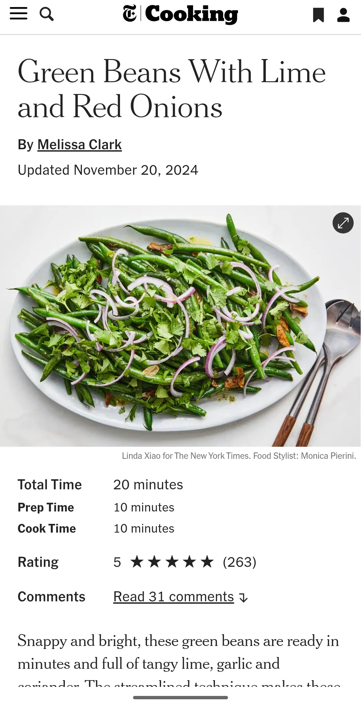

# Green Beans With Lime and Red Onions

{ loading=lazy }

| :fork_and_knife_with_plate: Serves | :timer_clock: Total Time |
|:----------------------------------:|:-----------------------: |
| 6 | 0 minutes |

## :salt: Ingredients

- :beans: 1 pound green beans
- :droplet: 3 tablespoons (43 g) water
- :olive: 2 tablespoons (25 g) extra-virgin olive oil
- :garlic: 4 cloves garlic cloves
- :chestnut: 1.25 teaspoons (2 g) ground coriander
- :salt: 0.5 teaspoon (3 g) fine sea salt
- :hot_pepper: 1 pinch crushed red pepper
- :tangerine: 1 lime
- :tea: 0.5 red onion
- :chestnut: 0.5 cup (21 g) chopped cilantro

## :cooking: Cookware

- 1 large skillet
- 1 platter

## :pencil: Instructions

### Step 1

Combine green beans (stem ends trimmed) and water in a large skillet over medium-high heat. Cook, stirring and shaking
the pan, until the beans are bright green and the water has evaporated from the skillet, 3 to 6 minutes.

### Step 2

Raise the heat to high and add the extra-virgin olive oil (more for drizzling), garlic cloves (thinly sliced), ground
coriander, fine sea salt (more to taste), and crushed red pepper. Cook for 1 to 2 minutes, or until the green beans are
just cooked through but still crisp-tender.

### Step 3

Stir in the lime (finely grated zest and juice of 1/2 lime). Taste for seasoning and add more salt or lime juice, as
needed.

### Step 4

Slide the green beans onto a platter and top with red onion (thinly sliced) and chopped cilantro (or parsley or mint).
Drizzle with more olive oil. Serve hot or at room temperature.

## :link: Source

- NYT Cooking
