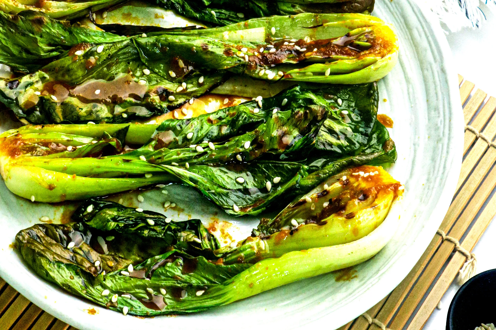

# :leafy_green: Miso-Glazed Bok Choy

{ loading=lazy }

| :timer_clock: Total Time |
|:-----------------------: |
| 2 minutes |

## :salt: Ingredients

- 1 small head bok choy
- 1 [miso glaze][1]

## :cooking: Cookware

- 1 metal or cast iron skillet

## :pencil: Instructions

### Step 1

Slice bok choy in half lengthwise and heat a metal or cast iron skillet over medium heat.

### Step 2

Brush [miso glaze][1] over bok choy. Once pan is hot, lay down bok choy cut-side down and sear for 1 to 2 minutes. Flip
and sear on other side.

## :link: Source

- <https://minimalistbaker.com/easy-vegan-ramen/#wprm-recipe-container-35499>

[1]: <../../sauces-and-dressings/gravy-and-savory-sauces/miso-glaze.md>
