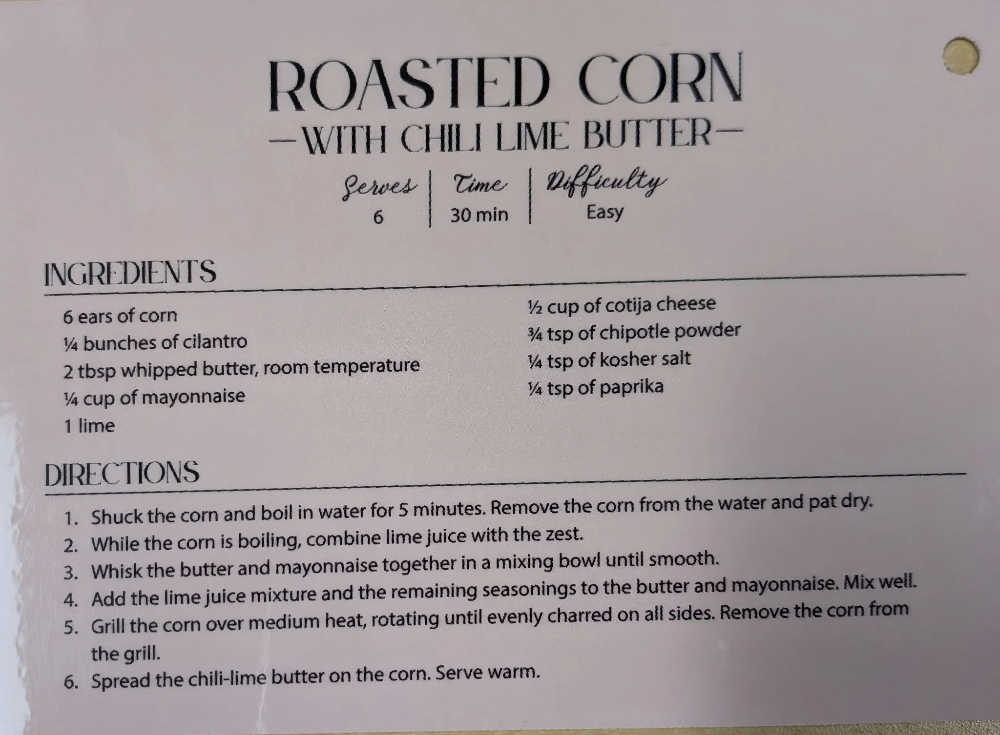

# Roasted Corn with Chile Lime Butter

{ loading=lazy }

| :fork_and_knife_with_plate: Serves | :timer_clock: Total Time |
|:----------------------------------:|:-----------------------: |
| 6 | 5 minutes |

## :salt: Ingredients

- :apple: 6 ears corn
- :tangerine: 1 lime
- :glass_of_milk: 2 tbsp (34 g) whipped butter
- :baby_bottle: 0.25 cup (56 g) mayonnaise
- :cheese_wedge: 0.5 cup (57 g) cotija cheese
- :hot_pepper: 0.75 tsp chipotle powder
- :salt: 0.25 tsp kosher salt
- :candy: 0.25 tsp paprika
- :herb: 0.25 bunch cilantro

## :cooking: Cookware

- 1 mixing bowl

## :pencil: Instructions

### Step 1

Shuck the corn and boil in water for 5 minutes. Remove the corn from the water and pat dry.

### Step 2

While the corn is boiling, combine lime juice with the zest.

### Step 3

Whisk the whipped butter and mayonnaise together in a mixing bowl until smooth.

### Step 4

Add the lime juice mixture, cotija cheese, chipotle powder, kosher salt, paprika, and cilantro to the butter and
mayonnaise. Mix well.

### Step 5

Grill the corn over medium heat, rotating until evenly charred on all sides. Remove the corn from the grill.

### Step 6

Spread the chili-lime butter on the corn. Serve warm.

## :link: Source

- Applied Kitchen
