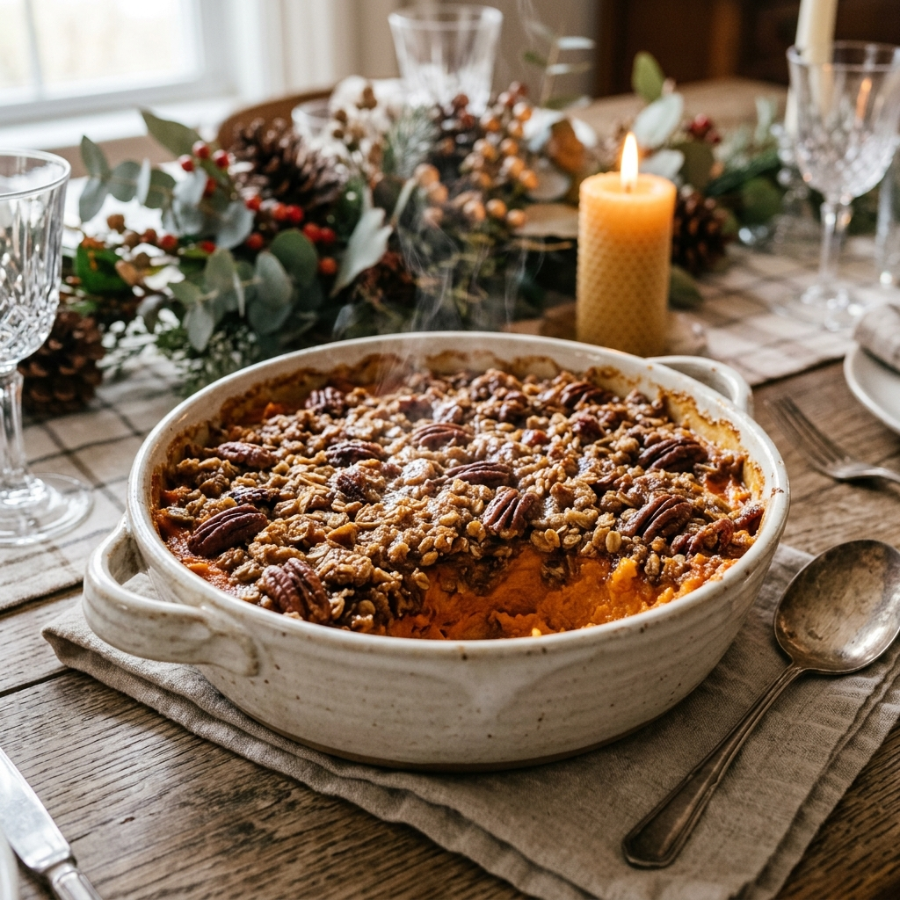

# :potato: Ruth's Chris Sweet Potato Casserole

{ loading=lazy }

| :fork_and_knife_with_plate: Serves | :timer_clock: Total Time |
|:----------------------------------:|:-----------------------: |
| 8-10 | 40 minutes |

## :salt: Ingredients

### Sweet Potatoes

- :potato: 3 cups sweet potatoes, cooked and mashed
- :candy: 1 cup sugar
- :salt: 0.5 tsp salt
- :ice_cream: 1 tsp vanilla
- :egg: 2 eggs, well beaten
- :butter: 1 stick butter, melted

### Crust Topping

- :maple_leaf: 1 cup brown sugar
- :ear_of_rice: 0.33 cup flour
- :chestnut: 1 cup pecans, chopped
- :butter: 0.33 cup butter, melted

## :cooking: Cookware

- 1 casserole pan
- 2 mixing bowls

## :pencil: Instructions

### Step 1

Preheat oven to 375°F (or 350°F). Butter a casserole pan.

### Step 2

**Make the Crust**: In a mixing bowl, combine the brown sugar, flour, chopped pecans, and 1/3 cup of melted butter. Mix until well combined and set aside.

### Step 3

**Make the Sweet Potatoes**: In a separate bowl, combine the mashed sweet potatoes, white sugar, salt, vanilla, beaten eggs, and 1 stick of melted butter. Mix thoroughly until smooth.

### Step 4

Pour the sweet potato mixture into the prepared casserole pan and bake for 30 minutes.

### Step 5

Top the baked potato base evenly with the crust mixture, and bake for 10 minutes longer (or until the topping is golden and bubbly). Let set for 15-30 minutes before serving.

## :link: Source

- [The Girl Who Ate Everything](https://www.the-girl-who-ate-everything.com/ruths-chris-sweet-potato-casserole/)
