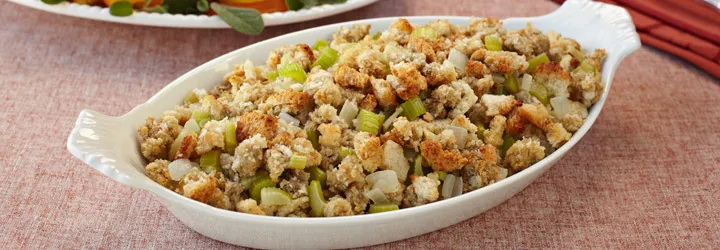

# :stuffed_flatbread: Vegetarian Stuffing

{ loading=lazy }

| :timer_clock: Total Time |
|:-----------------------: |
| 40 minutes |

## :salt: Ingredients

- 1 Mrs. Cubbison's stuffing
- :leafy_green: some celery
- :baby_bottle: some water chestnut
- some [vegetable broth][1]
- :tea: some onion
- :butter: some butter
- :herb: some poultry seasoning

## :pencil: Instructions

### Step 1

Prepare Mrs. Cubbison's stuffing as directed.

### Step 2

Add celery, water chestnut, [vegetable broth][1], onion, butter, and poultry seasoning to taste before baking.

[1]: <../../ingredients/vegetable-broth.md>
