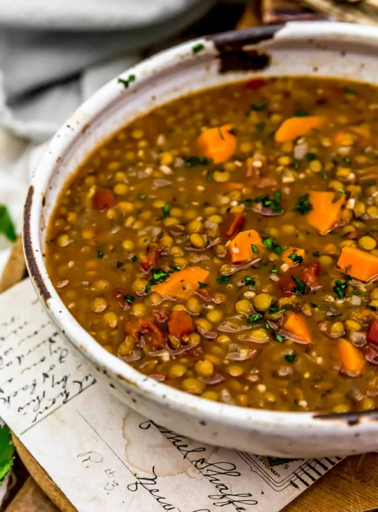

---
tags:

  - soups-and-stews
comments: true

hero: assets/images/chickenless-sausage-and-lentil-soup.webp
---

# :stew: Chickenless Sausage and Lentil Soup

{ loading=lazy }

| :fork_and_knife_with_plate: Serves | :timer_clock: Total Time |
|:----------------------------------:|:-----------------------: |
| 6 | 0 minutes |

## :salt: Ingredients

- :tea: 1 yellow onion
- 2 zucchini
- :salt: some salt
- :baby_bottle: 1 pkg TJ's Italian sausage-less sausage
- :glass_of_milk: 1 14-oz can tomatoes
- :beans: 1 cup (210 g) red lentils
- 4 cups [vegetable broth][1]
- :tangerine: some lemon wedges
- :herb: some fresh herbs

## :cooking: Cookware

- :shallow_pan_of_food: 1 large pot

## :pencil: Instructions

### Step 1

In a large pot, sauté diced yellow onion and chopped zucchini. Season with salt and sauté until onion is translucent.

### Step 2

Add diced TJ's Italian sausage-less sausage and sauté until lightly browned. Add diced tomatoes, red lentils, and
[vegetable broth][1]. Season and bring to a boil.

### Step 3

Reduce heat, cover, and simmer until lentils are cooked through. Taste and adjust seasoning, if needed.

### Step 4

Serve with lemon wedges and fresh herbs, if desired.

## :link: Source

- Trader Joe's

[1]: <../ingredients/vegetable-broth.md>
