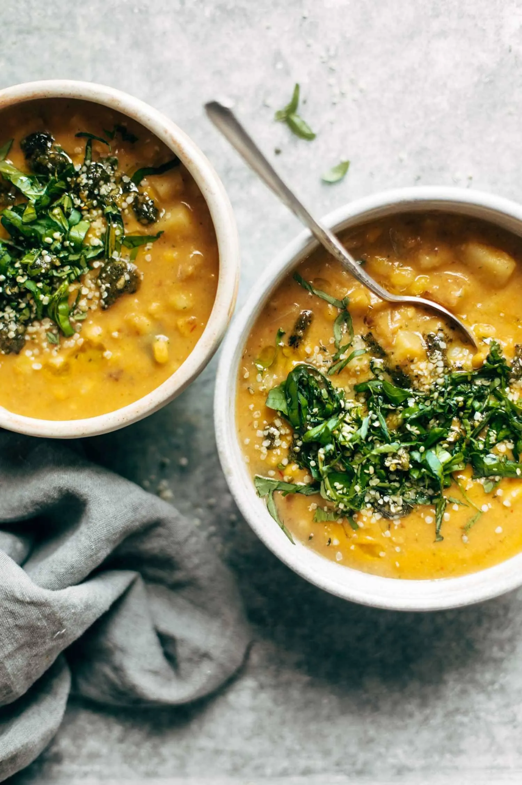

# :corn: Chipotle Corn Chowder

{ loading=lazy }

| :timer_clock: Total Time |
|:-----------------------: |
| 5 minutes |

## :salt: Ingredients

- 1.75 cups [Vegetable Broth](../ingredients/vegetable-broth.md)
- :beans: 1.5 cups (228 g) frozen corn
- :hot_pepper: 1 cup (142 g) green bell pepper
- :hot_pepper: 1 cup (210 g) red bell pepper
- :carrot: 1 cup (142 g) carrots
- :chestnut: 0.5 tsp (2 g) cumin
- :hot_pepper: 0.13 tsp cayenne pepper
- :coconut: 0.67 cup (162 g) evaporated fat-free milk
- :bread: 3 Tbsp (17 g) flour
- :burrito: 0.5 pkg Morning Star black bean crumbles
- :cheese_wedge: 0.25 cup (57 g) cheese

## :cooking: Cookware

- :shallow_pan_of_food: 1 large saucepan
- :bowl_with_spoon: 1 small bowl
- 1 whisk

## :pencil: Instructions

### Step 1

In a large saucepan, combine [Vegetable Broth](../ingredients/vegetable-broth.md), frozen corn, chopped green bell pepper, chopped red bell pepper, sliced
carrots, cumin, and cayenne pepper.

### Step 2

Bring to a boil. Reduce heat and simmer for 5 minutes.

### Step 3

In a small bowl, whisk together evaporated fat-free milk and flour. Stir into soup mixture and bring to a boil.

### Step 4

Mix in Morning Star black bean crumbles and heat through. Mix in cheese and stir until melted through.

## :link: Source

- Recipe Box
