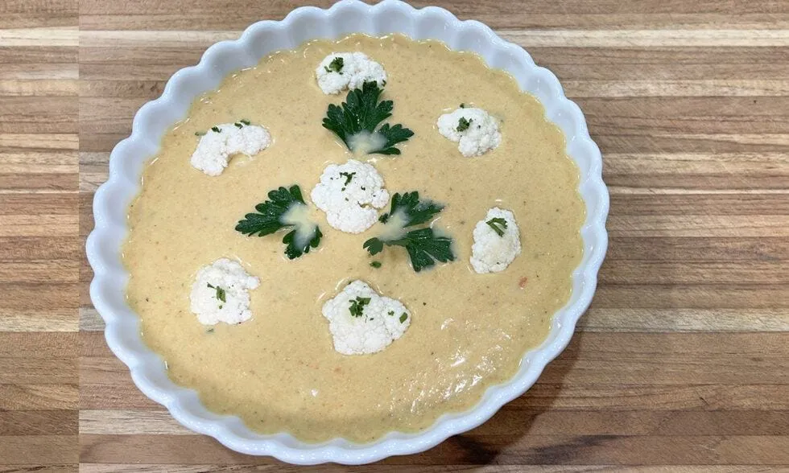

# :broccoli: Creamy Broccoli Bisque

{ loading=lazy }

| :timer_clock: Total Time |
|:-----------------------: |
| 1.50 hours |

## :salt: Ingredients

=== "serves 4"

    - :broccoli: 1 head broccoli
    - :glass_of_milk: some milk
    - :butter: 1 Tbsp (14 g) unsalted butter
    - :tea: 1 cup (96 g) onion
    - :garlic: 4 cloves garlic
    - :herb: 1 tsp thyme
    - :leafy_green: 1 cup (142 g) celery
    - :carrot: 1 cup carrot
    - :sweet_potato: 1 cup (184 g) potato
    - :stew: 4 cups (792 g) vegetable stock
    - :glass_of_milk: 0.66 cups (150 g) heavy cream
    - :cheese_wedge: 2.66 oz (38 g) English cheddar cheese
    - :salt: some salt
    - :salt: some pepper
    - :carrot: 0.33 carrot
    - :herb: 4 tsp parsley

=== "serves 12"

    - :broccoli: 3 heads broccoli
    - :glass_of_milk: some milk
    - :butter: 3 Tbsp (42 g) unsalted butter
    - :tea: 3 cups (288 g) onion
    - :garlic: 10 cloves garlic
    - :herb: 1 Tbsp thyme
    - :leafy_green: 3 cups (426 g) celery
    - :carrot: 3 cups (426 g) carrots
    - :sweet_potato: 3 cups (639 g) potatoes
    - :stew: 10 cups (1980 g) vegetable stock
    - :glass_of_milk: 2 cups (454 g) heavy cream
    - :cheese_wedge: 8 oz (114 g) English cheddar cheese
    - :salt: some salt
    - :salt: some pepper
    - :carrot: 1 carrot
    - :herb: 0.25 cup parsley

## :cooking: Cookware

- :gear: 1 immersion blender
- 1 large soup kettle

## :pencil: Instructions

### Step 1

Take some of the broccoli into florets and poach them separately from the soup in vegetable stock or milk. You will add
those at the end when the soup has been pulverized with the immersion blender.

### Step 2

In a large soup kettle, heat the unsalted butter and when hot add the onion and cook until translucent. (This could take
a few minutes). Add the garlic and when fragrant add thyme, celery, carrots and potatoes and broccoli.

### Step 3

Add the vegetable stock enough to barely cover all your vegetables.

### Step 4

Cook for about 90 minutes or until all vegetables are soft and cooked.

### Step 5

Using your immersion blender, process the soup until all the ingredients are nice and smooth. Add the heavy cream and
the English cheddar cheese; adjust the seasoning with salt and pepper. Add the shredded carrots, parsley and the
reserved florets.

!!! info

    The broccoli can be substituted for cauliflower

## :link: Source

- <https://chefjeanpierre.com/recipes/soups/creamy-cauliflower-bisque/>
