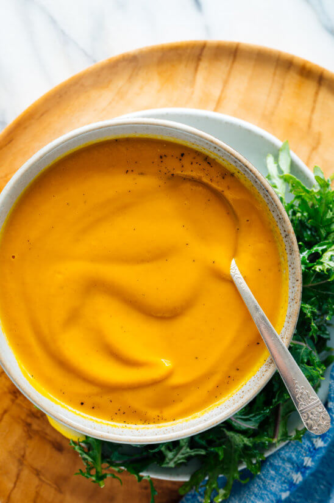

# :carrot: Creamy Roasted Carrot Soup

{ loading=lazy }

| :timer_clock: Total Time |
|:-----------------------: |
| 1.05 hours |

## :salt: Ingredients

- :carrot: 2 lb carrots
- :olive: 3 Tbsp olive oil
- :salt: 0.75 tsp salt
- :onion: 1 medium yellow onion
- :garlic: 2 cloves garlic
- :herb: 0.5 tsp coriander
- :custard: 0.25 tsp cumin
- :stew: 4 cup vegetable broth
- :droplet: 2 cup water
- :butter: 1.5 Tbsp butter
- :lemon: 1.5 tsp lemon juice
- :salt: some black pepper

## :cooking: Cookware

- 1 baking sheet
- 1 Dutch oven or soup pot
- 1 wooden spoon or sturdy silicone spatula
- 1 blender

## :pencil: Instructions

### Step 1

Preheat the oven to 400°F. Line a large rimmed baking sheet with parchment paper for easy cleanup, if desired.

### Step 2

To prepare your carrots, peel them and then cut them on the diagonal so each piece is about ½″ thick at the widest
part.

### Step 3

Place the carrots on the baking sheet. Add 2 tablespoons olive oil and ½ teaspoon of the salt. Toss until the carrots
are lightly coated in oil and seasonings. Arrange them in a single layer.

### Step 4

Roast the carrots until they’re caramelized on the edges and easily pierced through by a fork, 25 to 40 minutes,
tossing halfway. (Heirloom carrot varieties will roast in as little as 25 minutes, but regular carrots are more dense
and typically require 35 to 40 minutes.)

### Step 5

Once the carrots are almost done roasting, in a Dutch oven or soup pot, warm the remaining 1 tablespoon olive oil over
medium heat until shimmering. Add the yellow onion and ¼ teaspoon salt. Cook, stirring occasionally, until the onion is
softened and turning translucent, 5 to 7 minutes.

### Step 6

Add the garlic, coriander and cumin (if following a variation, see recipe notes for additions). Cook until fragrant
while stirring constantly, about 30 seconds to 1 minute. Pour in the vegetable broth and water, while scraping up any
browned bits on the bottom with a wooden spoon or sturdy silicone spatula.

### Step 7

Add the roasted carrots to the pot when they are out of the oven. Bring the mixture to a boil over high heat, then
reduce the heat as necessary to maintain a gentle simmer. Cook for 15 minutes, to give the flavors time to meld.

### Step 8

Once the soup is done cooking, remove the pot from the heat and let it cool for a few minutes. Then, carefully transfer
the hot soup to a blender, working in batches if necessary. (Do not fill past the maximum fill line or the soup could
overflow!)

### Step 9

Add the butter, lemon juice (or lime, if following the Thai variation), and several twists of black pepper. Blend until
completely smooth. Add additional salt and pepper if necessary, to taste. Add another tablespoon of butter if you’d
like more richness, or a little more lemon juice if it needs more zing. Blend again, and serve.

### Step 10

This soup keeps well in the refrigerator, covered, for about four days, or for several months in the freezer.

!!! info "Carrot Ginger Soup Variation"

    Add freshly grated ginger with the garlic and ground spices. Use 1 teaspoon for subtle ginger flavor, 2 teaspoons for more prominent flavor, or 1 tablespoon for relatively spicy carrot-ginger flavor.

!!! info "Curried Carrot Soup Variation"

    Add some curry powder with the garlic and ground spices. Use 1 teaspoon (mild) or up to 2 teaspoons (somewhat spicy), depending on your preferences. For curried ginger soup, also add 2 teaspoons finely grated fresh ginger at this time.

!!! info "Thai Curried Carrot Soup Variation"

    Add Thai red curry paste with the garlic and ground spices (be sure to choose a vegan/vegetarian option if you’re avoiding fish produces, such as Thai Kitchen). Use 1 ½ teaspoons (mild) or up to 1 tablespoon (relatively spicy), depending on your preferences. Substitute lime juice for the lemon. You might like to garnish your bowls of soup with some chopped roasted peanuts and fresh cilantro leaves.

## :link: Source

- <https://cookieandkate.com/roasted-carrot-soup-recipe/#tasty-recipes-35404-jump-target>
