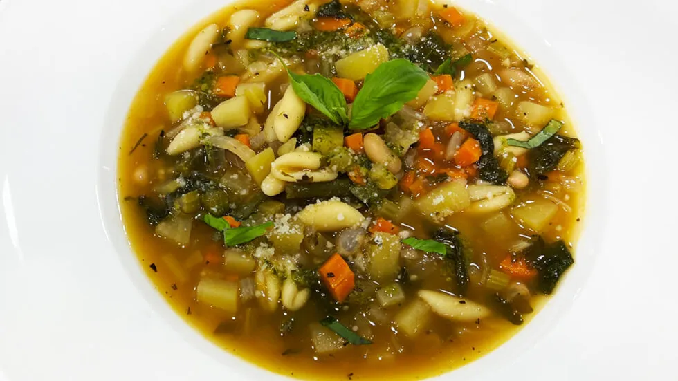

# :stew: Minestrone Soup

{ loading=lazy }

| :timer_clock: Total Time |
|:-----------------------: |
| 60 minutes |

## :salt: Ingredients

=== "serves 6"

    - :olive: 1 Tbsp (12 g) olive oil
    - :tea: 1 cup (96 g) onion
    - :garlic: 1 Tbsp garlic
    - :carrot: 1 cup (142 g) carrots
    - :leafy_green: 1 cups (142 g) celery
    - :herb: 1 Tbsp thyme
    - :tomato: 1 cup (180 g) tomatoes
    - :sweet_potato: 1.5 cups (320 g) potatoes
    - :stew: 5 cups (990 g) vegetable stock
    - :salt: some salt
    - :salt: some pepper
    - :beans: 0.5 lb green beans
    - :herb: 2 Tbsp cup parsley
    - :bread: 0.25 lb cavatelli pasta, or any small pasta
    - :herb: 2 Tbsp basil
    - :glass_of_milk: 0.5 28-oz can cannellini beans
    - :apple: 0.5 head escarole lettuce or green leaves
    - 2 Tbsp pesto
    - :cheese_wedge: 0.5 cup (50 g) Parmesan

=== "serves 12"

    - :olive: 1 Tbsp (12 g) olive oil
    - :tea: 2 cups (192 g) onion
    - :garlic: 2 Tbsp garlic
    - :carrot: 2 cups (284 g) carrots
    - :leafy_green: 2 cups (284 g) celery
    - :herb: 2 Tbsp thyme
    - :tomato: 2 cups (360 g) tomatoes
    - :sweet_potato: 3 cups (639 g) potatoes
    - :stew: 10 cups (1980 g) vegetable stock
    - :salt: some salt
    - :salt: some pepper
    - :beans: 1 lb green beans
    - :herb: 0.25 cup parsley
    - :bread: 0.5 lb cavatelli pasta, or any small pasta
    - :herb: 0.25 cup basil
    - :glass_of_milk: 1 28-oz can cannellini beans
    - :apple: 1 head escarole lettuce or green leaves
    - 0.25 cup pesto
    - :cheese_wedge: 1 cup (100 g) Parmesan

## :cooking: Cookware

- 1 large soup kettle

## :pencil: Instructions

### Step 1

In a large soup kettle, heat the olive oil. When the oil is hot, add the onion and cook until translucent.

### Step 2

Add the garlic and when fragrant, add the carrots, celery, thyme, tomatoes if stock doesn't contain tomatoes, and
potatoes. Add the vegetable stock until it just covers the top of the vegetables and salt and pepper to taste.

### Step 3

Cook for about 30 minutes at medium heat.

### Step 4

Add green beans and chopped parsley cook for 15 minutes more.

### Step 5

Add the cavatelli pasta, or any small pasta, basil and cook for another 15 minutes.

### Step 6

Add the cannellini beans and the chiffonade escarole lettuce or spinach.

### Step 7

Thin the pesto with a little bit of olive oil so the pesto is liquid.

### Step 8

Add the pesto and Parmesan as a decoration just before serving.

## :link: Source

- <https://chefjeanpierre.com/recipes/appetizers/minestrone-soup-recipe/>
