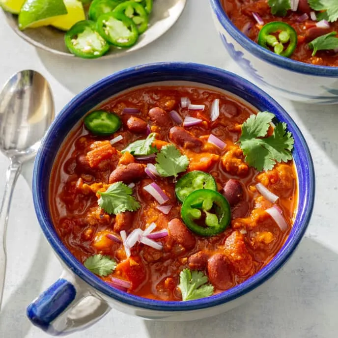

# :canned_food: Plant-Based Chili

{ loading=lazy }

| :fork_and_knife_with_plate: Serves | :timer_clock: Total Time |
|:----------------------------------:|:-----------------------: |
| 6 | 23 minutes |

## :salt: Ingredients

- :olive: 2 Tbsp (25 g) vegetable oil
- :tea: 2 onions
- :hot_pepper: 2 red bell peppers
- :garlic: 4 cloves garlic
- :hot_pepper: 1 Tbsp (7 g) chili powder
- :chestnut: 2 tsp (6 g) cumin
- :taco: 1 tsp (5 g) chipotle in adobe sauce
- :herb: 0.5 tsp oregano
- :salt: 0.5 tsp salt
- :salt: 0.25 tsp pepper
- :glass_of_milk: 12 oz (144 g) plant-based ground meat
- :glass_of_milk: 1 15-oz can kidney beans
- :glass_of_milk: 1 28-oz can tomatoes
- :apple: 1 15-oz can tomato sauce
- :droplet: 1 cup (227 g) water

## :cooking: Cookware

- 1 Dutch oven
- :spoon: 1 wooden spoon

## :pencil: Instructions

### Step 1

Heat vegetable oil in Dutch oven over medium heat until shimmering. Add finely chopped onions, red bell peppers, garlic,
chili powder, cumin, chipotle in adobe sauce, oregano, salt, and pepper and cook, stirring frequently, until vegetables
are softened, 8 to 10 minutes.

### Step 2

Stir in plant-based ground meat and cook, breaking up meat with wooden spoon, until firm crumbles form, about 3 minutes.
Stir in kidney beans, tomatoes and reserved juice, tomato sauce, and water. Scrape up browned bits on bottom of pot
using metal spatula or wooden spoon.

### Step 3

Bring to simmer, then reduce heat to low and simmer until chili is slightly thickened, 15 to 20 minutes. Season with
salt and pepper to taste, and serve.

### Add Extra Liquid

!!! note

    Although you may see a little moisture or fat left in the pan when you're cooking plant-based ground meat, it tends to
    release a smaller amount of liquid than animal meat does when cooked. In our chili recipe, we compensate for this by
    adding a cup of water to achieve the ideal consistency.

## :link: Source

- Cook's Illustrated
