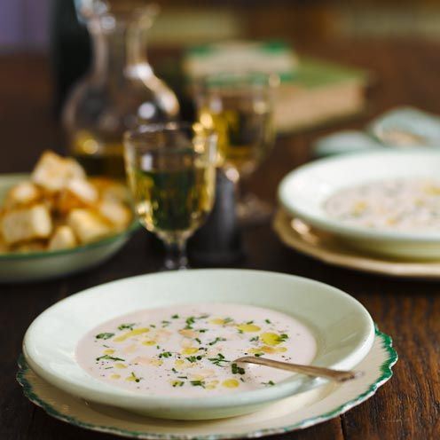

# :stew: Roasted Sweet Garlic & Almond Soup

{ loading=lazy }

| :timer_clock: Total Time |
|:-----------------------: |
| 1.17 hours |

## :salt: Ingredients

- :garlic: 3 bulbs garlic
- :onion: 1 white onion
- :olive: some olive oil
- :glass_of_milk: 9 oz half-and-half
- :stew: 1 qt [vegetable broth][1]
- :bread: 1 loaf ciabatta
- :wine_glass: 2 Tbsp white wine vinegar
- :chestnut: 150 g almonds
- :herb: some cilantro
- :salt: some salt
- :salt: some pepper

## :cooking: Cookware

- 1 large pot
- 1 immersion blender

## :pencil: Instructions

### Step 1

Roast garlic bulbs in oven at 350°F for 30 to 45 minutes.

### Step 2

Meanwhile, in a large pot, sauté chopped white onion in olive oil for 10 minutes. Add half-and-half and
[vegetable broth][1]. Bring to a boil and simmer 10 minutes.

### Step 3

Remove garlic from oven. Allow to cool slightly then squeeze out cloves. Whisk into soup.

### Step 4

Remove crust from ciabatta, rip bread into small pieces and add to soup. Add white wine vinegar and simmer for 5 minutes
more.

### Step 5

Toast almonds, then add to soup and mix with immersion blender. Top with cilantro, if desired. Season with salt and
pepper to taste.

[1]: <../ingredients/vegetable-broth.md>
