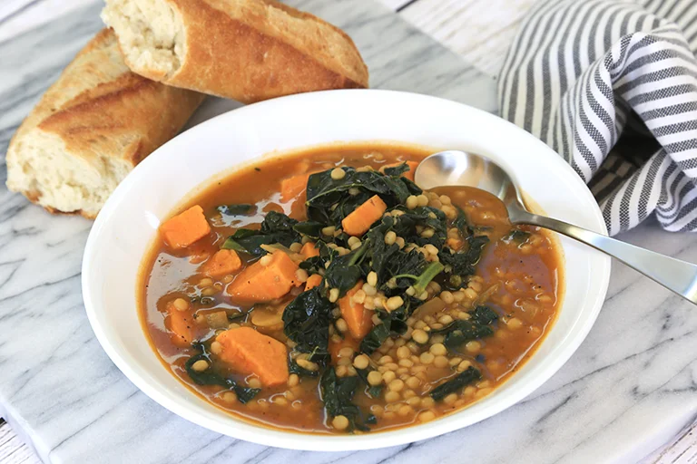

# :stew: Sam's Sweet Potato Soup

{ loading=lazy }

| :fork_and_knife_with_plate: Serves | :timer_clock: Total Time |
|:----------------------------------:|:-----------------------: |
| 4 | 60 minutes |

## :salt: Ingredients

- :avocado: 2 Tbsp avocado oil
- :onion: 0.5 jumbo yellow onion
- :sweet_potato: 2 medium sweet potato
- :rice: 0.5 cup Israeli couscous
- :stew: 6 cups [vegetable broth][1]
- :taco: 3 Tbsp [taco seasoning][2]
- :leafy_green: 0.5 bag TJ's Tuscan kale
- :salt: some salt
- :salt: some pepper

## :cooking: Cookware

- 1 large pot
- 1 large bowls

## :pencil: Instructions

### Step 1

In a large pot, heat avocado oil over medium heat. Add yellow onion and sweet potato and sauté 5 minutes. Add Israeli
couscous and sauté 5 minutes to toast. Add 2 tablespoons water to pot, cover and cook 3 minutes.

### Step 2

Remove lid and add [vegetable broth][1] and 2 to 3 Tbsps of [taco seasoning][2]. Reduce heat and simmer until sweet
potatoes are fork-tender, 25 to 30 minutes. Add TJ's Tuscan kale and simmer 5 minutes more until wilted. Season to
taste with salt and pepper.

### Step 3

Ladle soup into large bowls and serve with crusty bread for dipping.

## :link: Source

- Trader Joe's

[1]: <../ingredients/vegetable-broth.md>
[2]: <../ingredients/seasonings/taco-seasoning.md>
