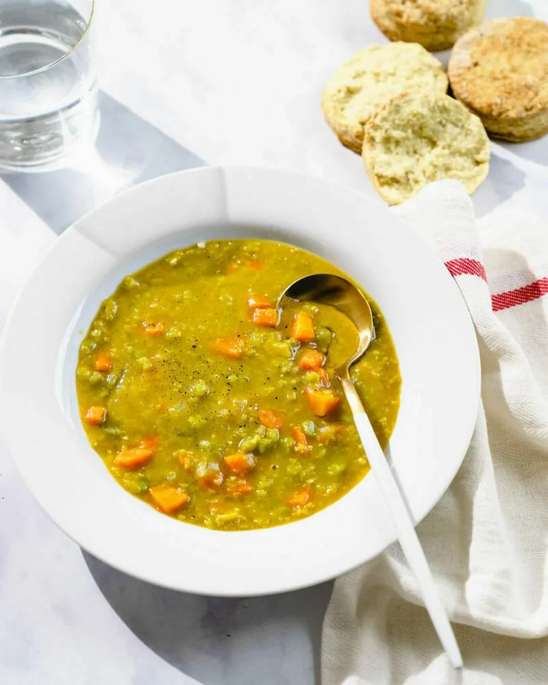

---
tags:

  - soups-and-stews
comments: true

hero: assets/images/split-pea-soup.webp
---

# :green_circle: Split Pea Soup

{ loading=lazy }

| :fork_and_knife_with_plate: Serves | :timer_clock: Total Time |
|:----------------------------------:|:-----------------------: |
| 6 | 60 minutes |

## :salt: Ingredients

- 6 cups [vegetable broth][1]
- :beans: 2 cup (224 g) dried green split peas
- :tea: 1 medium onion
- :leafy_green: 2 stalks celery
- :garlic: 2 cloves garlic
- :herb: 0.5 tsp marjoram
- :herb: 0.5 tsp basil
- :chestnut: 0.25 tsp (1 g) cumin
- :salt: 0.5 tsp salt
- :salt: 0.25 tsp pepper
- :carrot: 1 cup (142 g) chopped carrots
- :coconut: 5 Tbsp (31 g) shredded carrots
- :tea: 2 green onions

## :cooking: Cookware

- :shallow_pan_of_food: 1 large saucepan
- :gear: 1 immersion blender

## :pencil: Instructions

### Step 1

In a large saucepan, combine [vegetable broth][1], dried green split peas, onion, celery, garlic, marjoram, basil,
cumin, salt, pepper, and chopped carrots.

### Step 2

Bring to a boil, then reduce heat and simmer for 1 hour or until peas are tender, stirring occasionally.

### Step 3

When peas have fully cooked, puree with an immersion blender.

### Step 4

Garnish with shredded carrots and sliced green onions.

[1]: <../ingredients/vegetable-broth.md>
