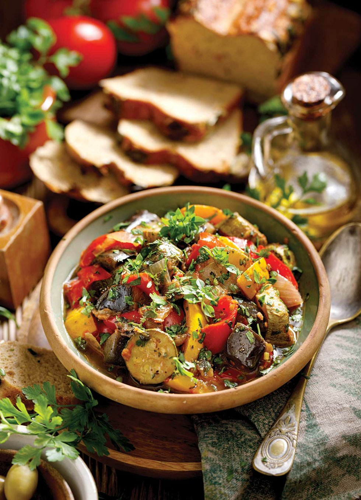

# Fennel and Potato Cassola

| :fork_and_knife_with_plate: Serves | :timer_clock: Total Time |
|:----------------------------------:|:-----------------------: |
| 4 | 24 minutes |

## :salt: Ingredients

- 3 baby bulbs fennel
- 1 sweet onion (Vidalia)
- 3 Yukon gold potatoes
- 3 Tbsp olive oil
- 1 cup water
- 3 bay leaves
- 1 cup water
- some salt
- some pepper

## :cooking: Cookware

- 1 large sauté pan

## :pencil: Instructions

### Step 1

In a large sauté pan, sauté stemmed, cored, and sliced into thin pieces fennel, roughly chopped sweet onion (Vidalia),
and 1" cubed Yukon gold potatoes in olive oil over medium-high heat until they are mostly cooked through, about 10
minutes.

### Step 2

Add 1 cup of water and bay leaves. Cook over medium-high heat until water boils off, about 6 to 7 minutes.

### Step 3

Add another cup of water and continue to cook until veggies are cooked through, about 6 to 7 minutes.

### Step 4

Remove from heat, discard bay leaves, and add salt and pepper to taste.

### Step 5

Serve with fresh fava beans with mint and scallions and cabbage and sun-dried tomato sauté.

## :link: Source

- The Blue Zones Kitchen
