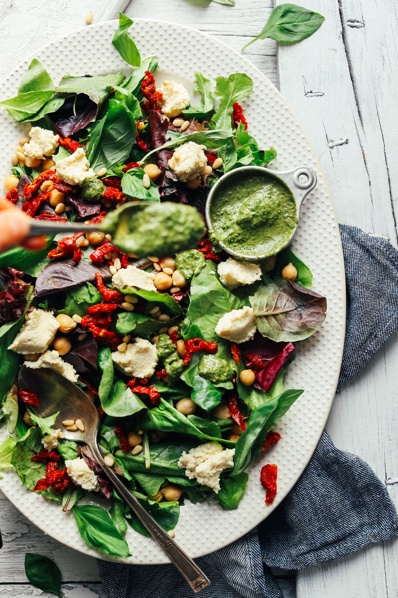

# :green_salad: Vegan Ricotta & Sun-Dried Tomato Pesto Salad

| :fork_and_knife_with_plate: Serves | :timer_clock: Total Time |
|:----------------------------------:|:-----------------------: |
| 2 | 30 minutes |

## :salt: Ingredients

- :chestnut: 0.75 cup [Whipped Almond Ricotta][2]
- :herb: 0.5 cup [pesto][1]
- :leafy_green: 6 cups mixed greens or spinach
- :tomato: 0.5 cup sun-dried tomatoes
- :chestnut: 0.5 cup pine nuts
- :falafel: 0.5 cup cooked chickpeas
- :lemon: 3 Tbsp lemon juice (optional)

## :pencil: Instructions

### Step 1

Start by preparing Whipped Almond Ricotta (follow link for instructions). Then set in refrigerator until serving.

### Step 2

Next prepare pesto dressing (follow link for instructions). Then cover and set in refrigerator until serving.

### Step 3

To plate, arrange mixed greens or spinach on a serving platter (or bowl) and top with sun-dried tomatoes, pine nuts, and
cooked chickpeas. Dollop on spoonfuls of almond ricotta and drizzle with vegan pesto. You can also squeeze with fresh
lemon juice (optional) for extra flavor and moisture.

### Step 4

Best when fresh. Store leftovers separately (undressed) up to 3 days in the refrigerator.

## :link: Source

- <https://minimalistbaker.com/vegan-ricotta-sun-dried-tomato-pesto-salad/>

[1]: <../sauces-and-dressings/cook's-country-perfect-pesto.md>
[2]: <../sauces-and-dressings/whipped-almond-ricotta.md>
